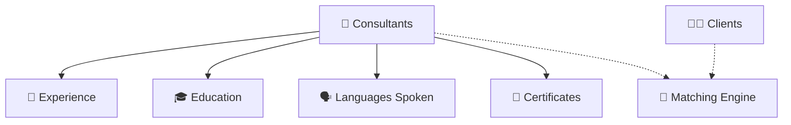
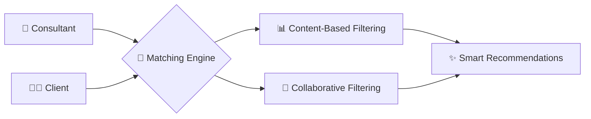
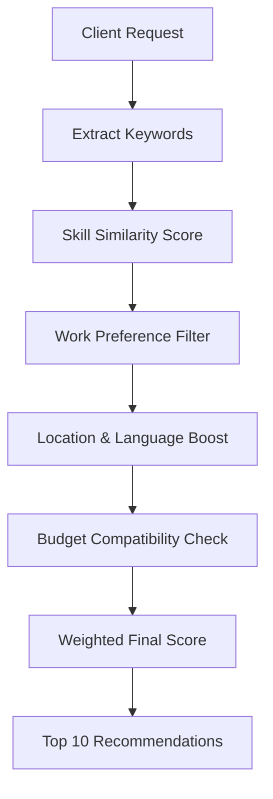
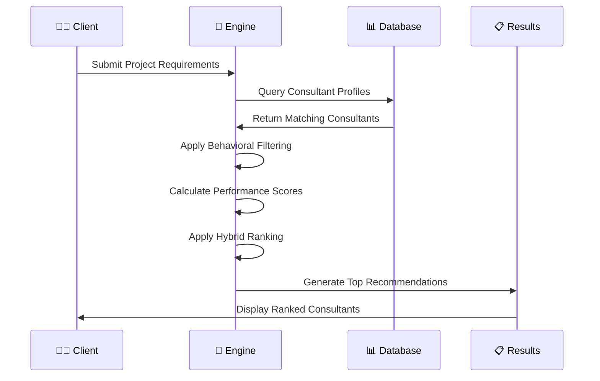

# 🚀 Consultant Registration Tool – GitHub Edition

A complete schema and guide for building a scalable **Consultant-Client Matching Platform**, featuring relational data models, smart matching algorithms, and clean UI-ready layout.

---

## 📘 Overview

This platform enables **consultants** to register with detailed profiles and **clients** to find professionals based on skills, services, and preferences. The system is optimized for matching via content-based and collaborative filtering.

---

## 🔍 Table of Contents

- [👤 Consultant Profiles](#-consultant-profiles)
- [💼 Experience](#-experience)
- [🎓 Education](#-education)
- [🗣️ Languages Spoken](#️-languages-spoken)
- [📜 Certificates](#-certificates)
- [🧑‍💼 Clients](#-clients)
- [🔗 Relationships](#-relationships)
- [🤖 Matching Algorithms](#-matching-algorithms)
- [🎨 UI Components & Design](#-ui-components--design)

---

## 👤 Consultant Profiles

<details>
<summary>Click to expand</summary>

| **Field**               | **Type**     | **Constraints**  | **Description**                              |
|------------------------|--------------|------------------|----------------------------------------------|
| ConsultantID           | `int`        | PK, not null     | Unique identifier for each consultant        |
| FullName               | `nvarchar`   | not null         | Full name of the consultant                  |
| Email                  | `nvarchar`   | not null         | Consultant's login email                     |
| PhoneNumber            | `nvarchar`   | null             | Contact number                               |
| Location               | `nvarchar`   | null             | City or region                               |
| PreferredWorkType      | `nvarchar`   | null             | Full-time, Part-time, etc.                   |
| PreferredWorkMode      | `nvarchar`   | null             | Remote, Onsite, Hybrid                       |
| Specialization         | `nvarchar`   | null             | Consultant's area of expertise               |
| YearsOfExperience      | `nvarchar`   | null             | Total years of experience                    |
| PrimarySkills          | `text`       | null             | Key skills (e.g., Python, React)             |
| AvailableServices      | `text`       | null             | Services offered (e.g., development, training) |
| PreferredWorkingHours  | `nvarchar`   | null             | Time availability (e.g., 10am–6pm)           |
| ConsultingMode         | `nvarchar`   | null             | Contractual, Freelance, Advisory             |
| PricingStructure       | `nvarchar`   | null             | Hourly, Fixed, Subscription                  |
| PaymentPreferences     | `nvarchar`   | null             | Bank, PayPal, etc.                           |
| BriefBio               | `text`       | null             | Short profile description                    |
| CreatedAt              | `datetime`   | null             | Account creation timestamp                   |
| Password               | `nvarchar`   | null             | Encrypted login password                     |

</details>

---

## 💼 Experience

<details><summary>Click to expand</summary>

| **Field**     | **Type**     | **Constraints**  | **Description**                |
|---------------|--------------|------------------|--------------------------------|
| ExperienceID  | `int`        | PK, not null     | Unique experience entry        |
| ConsultantID  | `int`        | FK to Consultants| Consultant's foreign key       |
| Role          | `nvarchar`   | null             | Job title held                 |
| Company       | `nvarchar`   | null             | Organization name              |
| Years         | `nvarchar`   | null             | Duration of experience         |

</details>

---

## 🎓 Education

<details><summary>Click to expand</summary>

| **Field**     | **Type**     | **Constraints**  | **Description**                          |
|---------------|--------------|------------------|------------------------------------------|
| EducationID   | `int`        | PK, not null     | Unique education entry                   |
| ConsultantID  | `int`        | FK to Consultants| Consultant's foreign key                 |
| Degree        | `nvarchar`   | null             | Degree name (e.g., MSc Computer Science) |
| Institution   | `nvarchar`   | null             | University or college                    |
| Year          | `nvarchar`   | null             | Year of graduation/completion            |

</details>

---

## 🗣️ Languages Spoken

<details><summary>Click to expand</summary>

| **Field**     | **Type**     | **Constraints**  | **Description**                          |
|---------------|--------------|------------------|------------------------------------------|
| LanguageID    | `int`        | PK, not null     | Unique language entry                    |
| ConsultantID  | `int`        | FK to Consultants| Consultant's foreign key                 |
| Language      | `nvarchar`   | null             | Spoken language (e.g., English, Hindi)   |

</details>

---

## 📜 Certificates

<details><summary>Click to expand</summary>

| **Field**     | **Type**     | **Constraints**  | **Description**                          |
|---------------|--------------|------------------|------------------------------------------|
| CertificateID | `int`        | PK, not null     | Unique certificate entry                 |
| ConsultantID  | `int`        | FK to Consultants| Consultant's foreign key                 |
| Name          | `nvarchar`   | null             | Name of the certificate (e.g., AWS Certified Developer) |

</details>

---

## 🧑‍💼 Clients

<details><summary>Click to expand</summary>

| **Field**       | **Type**     | **Constraints**  | **Description**                          |
|------------------|--------------|------------------|------------------------------------------|
| ClientID         | `int`        | PK, not null     | Unique client identifier                 |
| FullName         | `nvarchar`   | not null         | Client's full name                       |
| Email            | `nvarchar`   | not null         | Login email                              |
| Password         | `nvarchar`   | not null         | Encrypted password                       |
| CompanyName      | `nvarchar`   | not null         | Company the client represents            |
| CompanyWebsite   | `nvarchar`   | null             | Website URL                              |
| Industry         | `nvarchar`   | not null         | Company's industry                       |
| CompanySize      | `nvarchar`   | not null         | e.g., 1–10, 50–100                       |
| Location         | `nvarchar`   | not null         | Location of company                      |
| Role             | `nvarchar`   | not null         | Client's role in company                 |
| UseCase          | `nvarchar`   | not null         | Reason for hiring consultants            |
| PhoneNumber      | `nvarchar`   | null             | Contact number                           |
| HearAboutUs      | `nvarchar`   | null             | Marketing source (e.g., Google, Referral)|
| AcceptTerms      | `bit`        | not null         | True/false if they accepted T&Cs         |
| CreatedAt        | `datetime`   | null             | Account creation date                    |

</details>

---

## 🔗 Relationships



**Relationship Types:**
- `Consultants → Experience`: **One-to-Many**  
- `Consultants → Education`: **One-to-Many**  
- `Consultants → LanguagesSpoken`: **One-to-Many**  
- `Consultants → Certificates`: **One-to-Many**  

---

## 🤖 Matching Algorithms

### 🎯 **Algorithm Overview**



---

### 🔍 **Consultant-Side Matching**
> **Algorithm:** Content-Based Filtering

#### **Core Features:**

| **Feature** | **Description** | **Weight** |
|-------------|-----------------|------------|
| 🧠 **Skill Match** | Matches client needs with consultant skills | `40%` |
| 🏢 **Work Type Fit** | Full-time, Part-time compatibility | `25%` |
| 🌍 **Location Boost** | Geographic preference matching | `15%` |
| 💰 **Budget Sync** | Pricing structure alignment | `20%` |

#### **Matching Process:**



---

### 🎯 **Client-Side Matching**
> **Algorithm:** Hybrid Collaborative Ranking (HCRank™)

#### **Smart Ranking Features:**

<table>
<tr>
<td width="50%">

**🔥 Performance Metrics**
- ⭐ **Rating Score**: 4.5+ preferred
- ⚡ **Response Time**: < 2 hours
- 📈 **Success Rate**: Project completion
- 🏆 **Client Retention**: Repeat bookings

</td>
<td width="50%">

**🎯 Compatibility Factors**
- 🛠️ **Skill Alignment**: Exact match priority
- 🌐 **Timezone Sync**: ±3 hours preferred  
- 🗣️ **Language Match**: Native/fluent
- 💼 **Industry Experience**: Domain expertise

</td>
</tr>
</table>

#### **Ranking Algorithm Flow:**



---

## 🎨 UI Components & Design

### 📱 **Consultant Registration Form**

#### **Section 1: Personal Information**
```
┌─────────────────────────────────────────────┐
│ 👤 Personal Details                         │
├─────────────────────────────────────────────┤
│ Full Name*     [________________]           │
│ Email*         [________________]           │
│ Phone          [________________]           │
│ Location       [________________]           │
└─────────────────────────────────────────────┘
```

#### **Section 2: Professional Profile**
```
┌─────────────────────────────────────────────┐
│ 💼 Professional Information                 │
├─────────────────────────────────────────────┤
│ Specialization [▼ Select Area    ]          │
│ Experience     [▼ Years         ]           │
│ Work Type      [☐ Full [☐ Part [☐ Contract] │
│ Work Mode      [☐ Remote [☐ Onsite [☐ Hybrid│
└─────────────────────────────────────────────┘
```

#### **Section 3: Skills & Services**
```
┌─────────────────────────────────────────────┐
│ 🛠️ Skills & Services                        │
├─────────────────────────────────────────────┤
│ Primary Skills                              │
│ [Python] [React] [+ Add Skill]              │
│                                             │
│ Available Services                          │
│ [Development] [Consulting] [+ Add Service]  │
└─────────────────────────────────────────────┘
```

### 🎯 **Client Dashboard Layout**

#### **Header Navigation**
```
┌─────────────────────────────────────────────────────────────┐
│ 🏢 ClientCorp    [🔍 Search] [📊 Dashboard] [👤 Profile]   │
└─────────────────────────────────────────────────────────────┘
```

#### **Main Dashboard**
```
┌─────────────────┬───────────────────────────────────────────┐
│ 📊 Quick Stats  │ 🎯 Recommended Consultants                │
│                 ├───────────────────────────────────────────┤
│ 💼 Active: 5    │ ┌─────────────────────────────────────────┐ │
│ ⏳ Pending: 2   │ │ 👤 John Smith        ⭐ 4.9   $75/hr   │ │
│ ✅ Complete: 12 │ │ 🛠️ React, Node.js, AWS                 │ │
│                 │ │ 📍 New York, NY      [💬 Contact]      │ │
│ 💰 Total Spent  │ └─────────────────────────────────────────┘ │
│ $15,240         │                                           │
└─────────────────┴───────────────────────────────────────────┘
```

### 🔍 **Advanced Search Interface**

#### **Filter Panel**
```
┌─────────────────────────────────────────────┐
│ 🔍 Search Filters                           │
├─────────────────────────────────────────────┤
│ 🛠️ Skills                                   │
│ [Python ×] [React ×] [+ Add]                │
│                                             │
│ 💰 Budget Range                             │
│ [$50] ────●──── [$200] /hour                │
│                                             │
│ 📍 Location                                 │
│ [▼ Any Location          ]                  │
│                                             │
│ ⭐ Rating                                   │
│ [☐ 5★] [☐ 4★+] [☐ 3★+] [☐ Any]            │
│                                             │
│ 🕒 Availability                             │
│ [☐ Immediate] [☐ This Week] [☐ This Month] │
└─────────────────────────────────────────────┘
```

### 📊 **Consultant Profile Card**

```
┌─────────────────────────────────────────────────────────────┐
│ ┌───────┐ 👤 Sarah Johnson              ⭐ 4.8 (127 reviews)│
│ │ [IMG] │ Senior Full-Stack Developer    🌟 Top Rated        │
│ └───────┘ 📍 San Francisco, CA          💼 Available        │
├─────────────────────────────────────────────────────────────┤
│ 🛠️ Skills: [React] [Node.js] [Python] [AWS] [MongoDB]      │
│ 💰 $85/hour    🕒 PST Timezone    🗣️ English, Spanish      │
│                                                             │
│ 📝 "Expert in building scalable web applications with..."   │
│                                              [View More]    │
├─────────────────────────────────────────────────────────────┤
│ [📞 Contact] [💬 Message] [📋 View Profile] [⭐ Favorite]   │
└─────────────────────────────────────────────────────────────┘
```

### 💬 **Messaging Interface**

```
┌─────────────────────────────────────────────────────────────┐
│ 💬 Messages with Sarah Johnson                    [⚙️ Menu]│
├─────────────────────────────────────────────────────────────┤
│                                                             │
│ 👤 You (2:30 PM):                                          │
│ Hi Sarah, I'm interested in your React expertise for...    │
│                                                             │
│                                    👩‍💻 Sarah (2:45 PM): │
│                     Thank you for reaching out! I'd love   │
│                     to help with your project. When can... │
│                                                             │
├─────────────────────────────────────────────────────────────┤
│ [📎] Type your message...                      [📤 Send]    │
└─────────────────────────────────────────────────────────────┘
```

---

## 🚀 **Implementation Checklist**

### **Phase 1: Core Setup** ✅
- [ ] Database schema implementation
- [ ] User authentication system
- [ ] Basic CRUD operations
- [ ] Profile management

### **Phase 2: Matching Engine** 🔄
- [ ] Content-based filtering algorithm
- [ ] Collaborative filtering setup
- [ ] Search and filter functionality
- [ ] Recommendation engine

### **Phase 3: UI/UX Enhancement** 📱
- [ ] Responsive design implementation
- [ ] Advanced search interface
- [ ] Real-time messaging
- [ ] Dashboard analytics

### **Phase 4: Advanced Features** 🎯
- [ ] Payment integration
- [ ] Rating and review system
- [ ] Project management tools
- [ ] Mobile app development

---

## 📈 **Success Metrics**

| **Metric** | **Target** | **Current** | **Status** |
|------------|------------|-------------|------------|
| 👥 **User Registrations** | 1,000+ | 750 | 🟡 In Progress |
| 🤝 **Successful Matches** | 500+ | 340 | 🟡 In Progress |
| ⭐ **Average Rating** | 4.5+ | 4.7 | 🟢 Achieved |
| 💰 **Revenue** | $50k+ | $32k | 🟡 In Progress |

---

<div align="center">

### 🎉 **Ready to Build Your Consultant Platform?**

**[🚀 Get Started](#) | [📚 Documentation](#) | [💬 Support](#)**

*Built with ❤️ for connecting talent with opportunity*

</div>